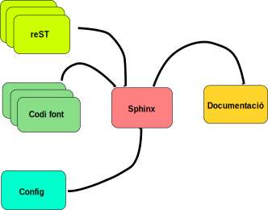

======
Sphinx
======

Introducció
===========

`Sphinx`_ és una eina de documentació específicament pensada per a
documentar programari tot i que també pot ser aplicada en altres
àmbits. Es una aplicació escrita en Python i extensible en base a
plugins (i.e. amb plugins es pot estendre la seva funcionalitat).

En essència permet construir i mantenir la documentació associada a un
projecte de programari a partir de dues fonts d'informació:

  1. Un conjunt de fitxers en format reST.
  2. El codi font del propi projecte i els docstrings que aquest
     contingui.

El resultat us semblarà familiar atès que és l'eina emprada per
mantenir la `documentació de Python <http://docs.python.org>`_ que
esteu acostumats a usar.

Per usar l'eina cal seguir un esquema de tres passos:

  1. Establir l'entorn de treball.
  2. Escriure la documentació i definir l'entorn.
  3. Generar la documentació resultant.

Com podeu veure en essència es tracta d'un *generador*, per això
sovint aquest tipus d'eines se les anomena *generadors de
documentació*. La documentació generada pot estar en diversos formats,
segons convingui. Per exemple en HTML o en PDF. Aquesta forma de
treball és molt convenient atès que els diferents formats de sortida
es generen a partir d'un unic original amb el conseqüent estalvi de
temps i garantia de coherència.

Establir l'entorn de treball
============================

Per establir l'entorn de treball usem la comanda `sphinx-quickstart`
que de manera interactiva va preguntant com volem configurar l'entorn
de generació de la docuemntació. Una sessió típica pot tenir aquest
aspecte:

.. code-block:: sh

   S'ha iniciat l'execució de script a dj 03 feb 2011 20:40:23 CET
   sebas@bubinga:/tmp$ sphinx-quickstart
   Welcome to the Sphinx 1.0.7 quickstart utility.

   Please enter values for the following settings (just press Enter to
   accept a default value, if one is given in brackets).

   Enter the root path for documentation.
   > Root path for the documentation [.]: doc

   You have two options for placing the build directory for Sphinx output.
   Either, you use a directory "_build" within the root path, or you separate
   "source" and "build" directories within the root path.
   > Separate source and build directories (y/N) [n]: y

   Inside the root directory, two more directories will be created; "_templates"
   for custom HTML templates and "_static" for custom stylesheets and other static
   files. You can enter another prefix (such as ".") to replace the underscore.
   > Name prefix for templates and static dir [_]: .

   The project name will occur in several places in the built documentation.
   > Project name: Reductio
   > Author name(s): S. Vila-Marta

   Sphinx has the notion of a "version" and a "release" for the
   software. Each version can have multiple releases. For example, for
   Python the version is something like 2.5 or 3.0, while the release is
   something like 2.5.1 or 3.0a1.  If you don't need this dual structure,
   just set both to the same value.
   > Project version: 1.0
   > Project release [1.0]: 1.0b2

   The file name suffix for source files. Commonly, this is either ".txt"
   or ".rst".  Only files with this suffix are considered documents.
   > Source file suffix [.rst]:

   One document is special in that it is considered the top node of the
   "contents tree", that is, it is the root of the hierarchical structure
   of the documents. Normally, this is "index", but if your "index"
   document is a custom template, you can also set this to another filename.
   > Name of your master document (without suffix) [index]:

   Sphinx can also add configuration for epub output:
   > Do you want to use the epub builder (y/N) [n]:

   Please indicate if you want to use one of the following Sphinx extensions:
   > autodoc: automatically insert docstrings from modules (y/N) [n]: y
   > doctest: automatically test code snippets in doctest blocks (y/N) [n]: 
   > intersphinx: link between Sphinx documentation of different projects (y/N) [n]:
   > todo: write "todo" entries that can be shown or hidden on build (y/N) [n]:
   > coverage: checks for documentation coverage (y/N) [n]:
   > pngmath: include math, rendered as PNG images (y/N) [n]:
   > jsmath: include math, rendered in the browser by JSMath (y/N) [n]:
   > ifconfig: conditional inclusion of content based on config values (y/N) [n]:
   > viewcode: include links to the source code of documented Python objects (y/N) [n]: y

   A Makefile and a Windows command file can be generated for you so that you
   only have to run e.g. `make html' instead of invoking sphinx-build
   directly.
   > Create Makefile? (Y/n) [y]:
   > Create Windows command file? (Y/n) [y]: n

   Finished: An initial directory structure has been created

   You should now populate your master file doc/source/index.rst and
   create other documentation source files. Use the Makefile to build
   the docs, like so:

   $ make builder

   where "builder" is one of the supported builders, e.g. html, latex or linkcheck.

   sebas@bubinga: /tmp$ 

Aquesta comanda crea una estructura de directoris dins de :file:`doc`
preparada per a rebre la documentació. El directori principal és
:file:`doc/source`, que és el que contindrà els fitxers reST amb el
gruix de la documentació original o font. El directori
:file:`doc/build` contindrà la documentació generada en el format de
sortida.

Escriure documentació
=====================

L'estructura del directori :file:`source`
-----------------------------------------

La documentació s'escriu en el directori :file:`source`. En aquest
directori hi ha dos fitxers fonamentals:

  :file:`conf.py`
  
      Aquest fitxer és un mòdul Python i conté la configuració que
      usarà Sphinx per processar els nostres documents.

  :file:`index.rst`

      Aquest és un fitxer de text en format reST que defineix l'índex
      de la documentació. En seu contingut s'indica la col·lecció de
      fitxers que conformen la documentació i l'ordre com han de
      sortir en l'índex del document.

A banda dels fitxers anteriors és en aquest directori on habiten els
fitxers en format reST que conformen la resta de la documentació. Així
doncs, per escriure documentació cal:

1. Escriure-la en un fitxer en format reST.
2. Declarar el fitxer en l'índex

Afegir un document
------------------

Suposem que volem afegir un nou capítol al nostre document. Aleshores
cal crear un fitxer en el directori :file:`source`, diguem que en diem
:file:`cap1.rst`. Aquest fitxer conté el capítol escrit en format
reST com ara el següent:

.. code-block:: rest

   ===========
   Introducció
   ===========

   En la producció de programari i en l'àmbit tecnològic en general la
   documentació tècnica té un paper fonamental. En aquesta pràctica
   estudiarem el problema de la documentació del programari i també
   algunes eines com **Sphinx** que simplifiquen aquesta feina.

   Entenem per documentació tècnica d'un programari tot aquella
   documentació que descriu amb precissió com és aquest programari i com
   se'n fa ús quan el lector target és una persona de perfil tècnic.
   Entre altres coses pot descriure:

     * L'arquitectura del programa o mòdul. És a dir de quins blocs està
       format, quina funcionalitat tenen i quines interrelacions hi ha
       entre ells.

     * Les funcions de cada mòdul i la seva especificació.

     * Documentació d'utilització incloent doctests i altres exemples
       d'ús.

     * Principis de disseny que s'han utilitzat.

     * Referències a altres documents importants en relació a aquest
       software.

A continuació cal modificar el fitxer :file:`index.rst` i citar el
fitxer anterior. El resultat ha de ser semblant al que segueix:

.. code-block:: rest

   .. Prova Sphinx documentation master file, created by
      sphinx-quickstart on Tue Feb  1 10:00:29 2011.
      You can adapt this file completely to your liking, but it should at least
      contain the root `toctree` directive.

   ===============================
   Documentació tècnica amb Sphinx
   ===============================

   Índex
   =====

   .. toctree::
      :maxdepth: 2

      cap1

Generar documentació
====================

Generar la documentació és senzill. Simplement cal, des del directori
arrel de la documentació, executar la comanda:

.. code-block:: bash

   $ make html

Aquesta comanda usa l'eina `make
<http://en.wikipedia.org/wiki/Make_%28software%29>`_ per reconstruir
un conjunt de pàgines html correctament enllaçades en el directori
:file:`build/html`.

Podeu veure el resultat arrencant un navegador i citant el fitxer
:file:`build/html/index.html`. Us apareixerà la documentació que heu
escrit prèviament adequadament enllaçada.
