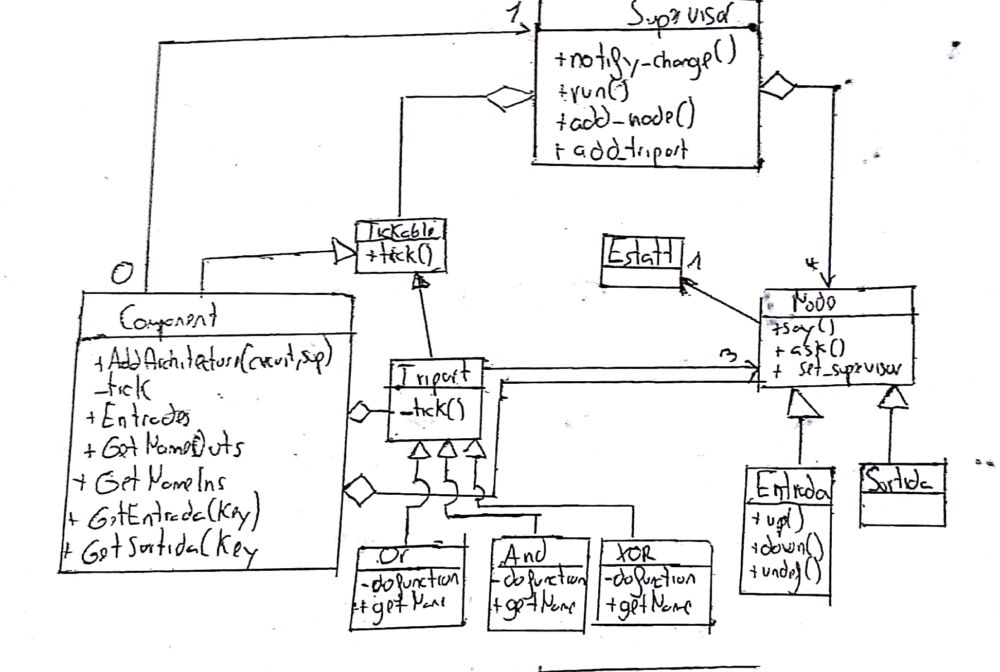

=============================================
Pràctica 5: Simulador de circuits digitals
=============================================

:Author: David Marquez i Ferran Godoy
:Date: 16/04/2018

Objectius
=========

Els objectius d’aquesta pràctica són:

    * Prendre contacte amb els programes estructurats en base a classes d’objectes i, particularment, amb relacions d’herència.
    * Consolidar l’ús de les eines de test i el disseny basat en tests.
    * Consolidar l’ús de les eines de documentació de programari i de les eines de gestió de versions.

La pràctica té com a context la simulació de circuı̈ts digitals i el seu fi és la implementació
d’un simulador de circuı̈ts combinacionals.

Temps dedicat a les tasques
===========================

====== ========= ========== =========
Tasca   David M.  Ferran G.  Total
====== ========= ========== =========
T1        5min      0min      5min
T2        0min      10min     10min
T3        5min      5min      10min
T4        0min      15min     15min
T5        15min     0min      15min
T6        0min      20min     20min
T7        30min     0min      30min
T8        0min      30min     30min
T9        1h        1h        2h
T10       5min      5min      5min
T11       15min     10min     25min
T12       1h        30min     1h30min
T13       20min     20min

Total    3h35min   3h35min    7h5min
====== ========= ========== =========

Toc personal
============

El nostre toc personal ha estat afegir una nova classe: Component.

Un component és, tal com indica el seu nom un component del circuit amb n entrades i m sortides. Funciona tal com ho
fa una entity de VHDL. S'inicialitza amb unes entrades i unes sortides i més tard s'hi afegeix una arquitectura i
un supervisor privat.

Cada component tindrà un supervisor privat, que calculara les sortides del component a partir de les entrades. Ho hem fet
utilitzant el supervisor ja creat. Per fer que el circuit funcionés amb múltiples supervisors, la variable __changed ha passat
de ser privada a ser estàtica. D'aquesta manera tots els supervisors del circuit sabran si s'ha canviat qualsevol senyal i per tant seguiran
actualitzant els nodes i triports fins que la variable Changed es mantingui a False (tots els supervisors no han detectat cap canvi).

UML resultant (toc personal inclòs)
===================================

El UML resultant amb el toc personal:

Circuit Simulant
=================

El circuit resultant del Main:

.. image:: Circuit.jpg

