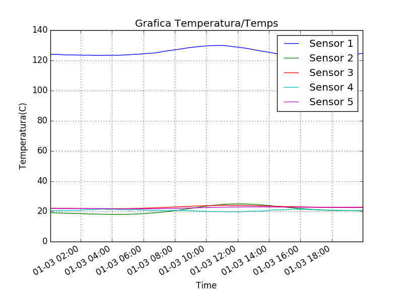
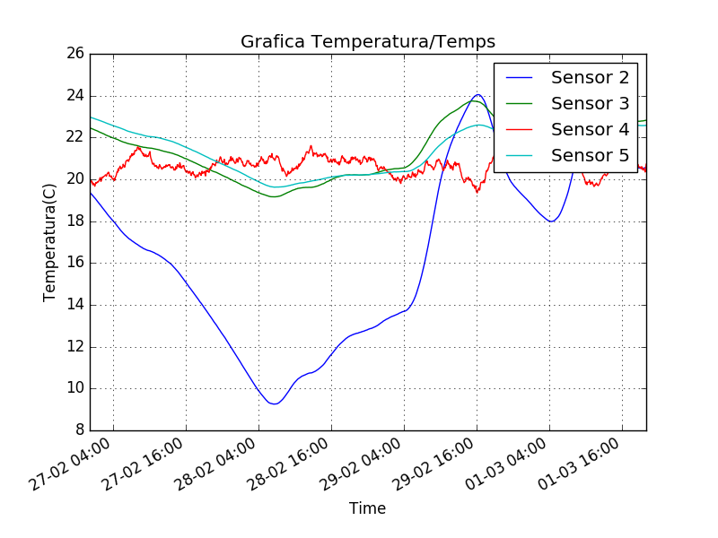

=============================================
Pràctica 6: Tractament de dades de sensors
=============================================

:Author: David Marquez i Ferran Godoy
:Date: 7/05/2018

Objectius
=========

Els objectius d’aquesta pràctica són:

    * Tenir un primer contacte amb alguns serveis de la extensa llibreria de Python.
    * Consolidar el treball amb classes d’objectes.
    * Consolidar l’ús de les eines de test i el disseny basat en tests.
    * Consolidar l’ús de les eines de documentació de programari i de les eines de gestió de versions.

La pràctica té com a context la captura, emmagatzemat, tractament i visualització de dades
provinents d’un sistema de sensors que capturen les temperatures de diferents punts del laboratori
de recerca de telecomunicacions.
La pràctica és molt curta pel que fa al codi que cal escriure. La solució no s’allarga massa
més de les 200 lı́nies de codi. La principal dificultat està en entendre i saber aprofitar els mòduls
de la llibreria que cal utilitzar. És doncs una pràctica més d’estudi i exploració que no pas de
desenvolupament.

Temps dedicat a les tasques
===========================

====== ========= ========== =========
Tasca   David M.  Ferran G.  Total
====== ========= ========== =========
T1      20min      10min      30min
T2      5min       10min      15min
T3      20min      20min      40min
T4      10min      40min      50min
T5      10min      10min      20min
T6      10min      10min      20min
T7      15min      15min      30min
T8      1h         1h30min    2h30min
T9      10min      10min      20min
T10     30min      15min      45min
T11     1h30min    30min      2h
T12     1h30min    30min      2h
T13     20min      20min      40min
T14     1h         1h         2h
T15     30min      30min      1h

Total   480min     400min     880min
====== ========= ========== =========

Com utilitzar
==============

Per iniciar el programa cal escriure per la terminal la comanda *explora*

    explora -d 1/3/2016

Hi ha varies comandes. La única que és obligatòria és *-d*:

    1. LinkCommand -v: Comanda opcional per especificar un link. Si no s'especifica es posarà el link on hi ha tots els csv.
    2. SensorCommand -s: Comanda utiltizada per especificar els sensors dels quals es vol extreure la informació. És opcional (el sensor de default és  el 0)
    #. DayCommand -d: El dia del qual es vol treure les dades. El format ha de ser dd/mm/yyyy. És la única obligatòria
    #. ToDayCommand -t: S'utilitza per especificar un interval. És opcional.

Toc personal
============

El nostre toc personal ha estat afegir una nova funcionalitat a la gràfica. El que es fa és fer que si es fa un doble click
sobre la gràfica se't printeja per la terminal els datasets que formen aquell gràfic.

Imatges d'exemple de gràfics
===================================

Comanda utilitzada per la següent gràfica:

    explora -d 1/3/2016 -s 1,2,3,4,5

Comanda utilitzada per a la següent gràfica:

    explora -t 1/3/2016 -d 27/2/2016 -s 2,3,4,5

Recursivitat
=============

Només hem aplicat recursivitat en el mòdul Dataset i DataFetcher.

Hem aplicat recursivitat a l’hora de realitzar la funció decimate(aplicat a
la funció protegida) perquè havíem de realitzar un càlcul repetidament (agrupar de k en k, fer la mitja i agafar la data del més gran).
Seguint la mateixa metodologia ho hem aplicat a la funció protegida de moving_average, on també havíem de repetir la
mateixa acció vàries vegades (s'agafava de k en k valors i s'anava desplaçant d'un amb un).

En el DataFetcher ho hem utilitzat al fetch_interval, que crea un dataset a partir d'un rang de dies (el dataset de cada
dia el calcula amb el fetch).

